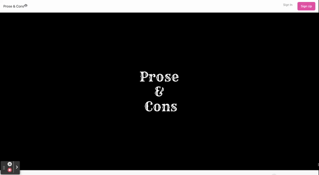

# Prose & Cons

## Table of Contents

- [**Description**](#📑-description)
- [**Usage**](#💻-usage)
- [**Contribution**](#🤝-contribution)
- [**Technology**](#🚀-technology)
- [**Test**](#🧪-test)
- [**Questions**](#❓-questions)

## 📑 Description

Prose & Cons is a web application designed to cultivate a community around book ratings and recommendations. Every user creates a unique profile, where they add books they've read into their own personal library. Users can also leave a rating on these books, from 1 star (lowest score) to 5 (highest score).

Another exciting feature of Prose and Cons is the ability for users to connect with one another. Users have the capability to peruse their friends' libraries, giving them access to see the book they have read as well as their ratings.

If a user thinks a friend would enjoy a book they have read, they can easily send the recommendation to them with a note if they wish to.

[Visit Prose & Cons](https://prose-n-cons.herokuapp.com/)

## 💻 Usage

**Sign-up Form**

**User Login Form**

**User Library**

## 🚀 Technology

## 🧪 Test

## ❓ Questions

🖐 Meet the team! If you have any question about us or the project, feel free to reach out:

#### **Austin Zumbro**

#### **Brian Alberson**

#### **Cassie Tepper**

#### **Jonny Borroell**

